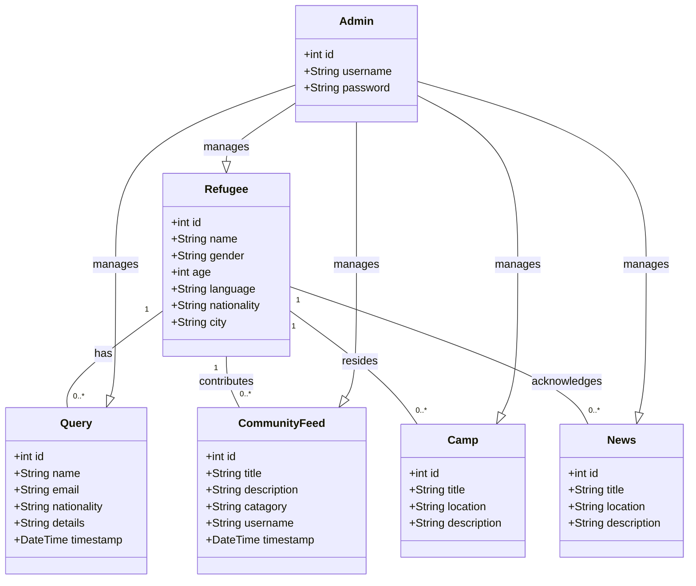

# SafeHaven

SafeHaven is a web application designed to assist refugees in finding suitable camps and accessing necessary resources. Whether it's education, shelter, medical, or community center. SafeHaven aims to provide a platform where refugees can easily locate and connect with relevant support services.

## Features

- **User Registration**: Refugees can register themselves on the platform to access its features.
- **Camp Locator**: Users can search for camps based on their location on map along with direction to camp.
- **Language Support**: SafeHaven offers language support to cater to the diverse linguistic needs of refugees.
- **Admin Dashboard**: Admin will have analytics based on refugees location.
- **Community Post Filtering**: Users can filter posts based on their specific requirements such as education, shelter, medical, or community center.
- **Community Feed**: SafeHaven provides a community feed where refugees can post and interact with each other.
- **Topic Filtering**: Users can filter community feed topics to find relevant posts easily.

## Object Model

## REST API Endpoints

### Refugee Endpoints:
- `GET /refugees`: Retrieve all refugees (accessible to Admin).
- `POST /refugees`: Create a new refugee.
- `GET /refugees/{id}`: Retrieve a specific refugee.
- `PUT /refugees/{id}`: Update a specific refugee.
- `DELETE /refugees/{id}`: Delete a specific refugee (accessible to Admin).

### CommunityFeed Endpoints:
- `GET /community-feed`: Retrieve all community feed posts (accessible to logged-in users).
- `POST /community-feed`: Create a new community feed post (accessible to logged-in users).
- `GET /community-feed/{id}`: Retrieve a specific community feed post (accessible to logged-in users).
- `PUT /community-feed/{id}`: Update a specific community feed post (accessible to Admin).
- `DELETE /community-feed/{id}`: Delete a specific community feed post (accessible to Admin).

### Camp Endpoints:
- `GET /camps`: Retrieve all camps.
- `POST /camps`: Create a new camp (accessible to Admin).
- `GET /camps/{id}`: Retrieve a specific camp.
- `PUT /camps/{id}`: Update a specific camp (accessible to Admin).
- `DELETE /camps/{id}`: Delete a specific camp (accessible to Admin).

### News Endpoints:
- `GET /news`: Retrieve all news.
- `POST /news`: Create a new camp (accessible to Admin).
- `GET /news/{id}`: Retrieve a specific camp.
- `PUT /news/{id}`: Update a specific camp (accessible to Admin).
- `DELETE /news/{id}`: Delete a specific camp (accessible to Admin).

### Query Endpoints:
- `POST /query`: Create a new assistance request.
- `GET /query`: Retrieve all assistance requests (accessible to Admin).
- `GET /query/{id}`: Retrieve a specific assistance request (accessible to Admin).
- `PUT /query/{id}`: Update a specific assistance request (accessible to Admin).
- `DELETE /query/{id}`: Delete a specific assistance request (accessible to Admin).

### Authentication Endpoints:
- `POST /login`: Authenticate and receive an access token.

## Contributors

Meet the Team : Sohan Patil , Damini Thorat , Smit Patel , Daksh Patel

## License

SafeHaven is licensed under the MIT License. See the LICENSE file for more information.

## Contact

If you have any questions or suggestions regarding SafeHaven, feel free to contact us at teamatsafehaven@gmail.com. We appreciate your feedback!